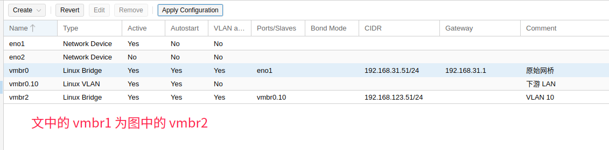
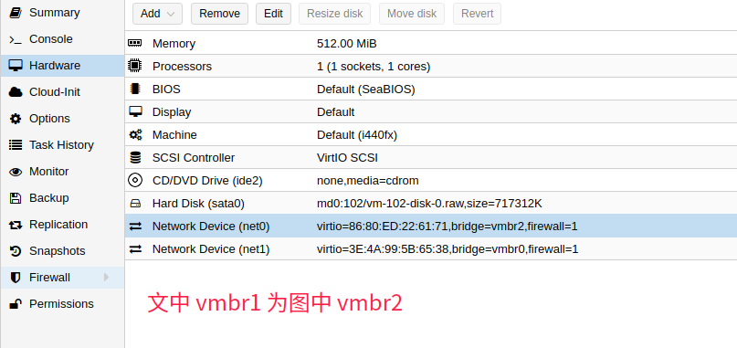

# PVE 配置VLAN

## 网络信息于设计

> ### 硬件信息
>
> **主路由** ASUS  `192.168.31.1/24`
>
> **子路由** Lede虚拟机 `192.168.31.252/24`
>
> **PVE** `192.168.51/24`
>
> **主机A** `192.168.31.59/24`
>
> **主机B** `192.168.123.88/24`
>
> ### 网段信息
>
> **主网络** `192.168.31.0/24`  `VLAN 100`
>
> **子网络** `192.168.123.0/24`  `VLAN 10`

## PVE 网络配置

> ### 网络设置
>
> **PVE** 地址在**主网络 192.168.31.51/24**上, 以**以普通太网帧** 通行无需设置，使用默认的**vmbr0**网桥用作`WAN 口`。
>
> 使用 **linux VLAN** 创建 `vmbr0.10`的 `VLAN 10` 。基于`vmbr0.10` 创建 `vmbr1`的**网桥**用作`LAN 口`。
>
> *注: 创建 linux VLAN 需要使用 PVE 免费源 并更新! 配置好 VLAN 后需要**重启生效*** 
>
>  
>
> 
>
> ### 添加 LEDE 虚拟机作为子路由
>
> 添加**两张网卡**分别作为**LAN 口**  **WAN 口**
>
> **第一个**虚拟网卡为**LAN 口** , 所以我们需要基于`vmbr1`创建。
>
> **第二个** 虚拟网卡为**WAN 口**, 所以我们自只需要使用`vmbr0` 创建。
>
> 

## 交换机配置

> ### 网口规划
>
> #### VLAN 设置
>
> <table>
> <tr>
> <th></th>
> <th>1</th>
> <th>2</th>
> <th>3</th>
> <th>4</th>
> <th>5</th>
> <th>6</th>
> <th>7</th>
> <th>8</th>
> </tr>
> <tr>
>  <th>VLAN 10</th>
>  <td colspan=2>-</td>
>  <td>T</td>
>  <td>U</td>
>  <td>U</td>
>  <td>U</td>
>  <td>U</td>
>  <td>U</td>
> </tr>
> <tr>
>  <th>VLAN 100</th>
>  <td>U</td>
>  <td>U</td>
>  <td>U</td>
>  <td colspan=5>-</td>
> </tr>
> </table>
>
> #### PVID 设置
> | 1    | 2    | 3    | 4    | 5    | 6    | 7    | 8    |
> | ---- | ---- | ---- | ---- | ---- | ---- | ---- | ---- |
> | 100  | 100  | 100  | 10   | 10   | 10   | 10   | 10   |
>
> 
>
>
> ### 物理链接图
>
> | 1               | 2    | 3    | 4     | 5    | 6    | 7    | 8    |
> | --------------- | ---- | ---- | ----- | ---- | ---- | ---- | ---- |
> | 链接主路由LAN口 | ILO  | PVE  | 主机B |      |      |      |      |
>
> 